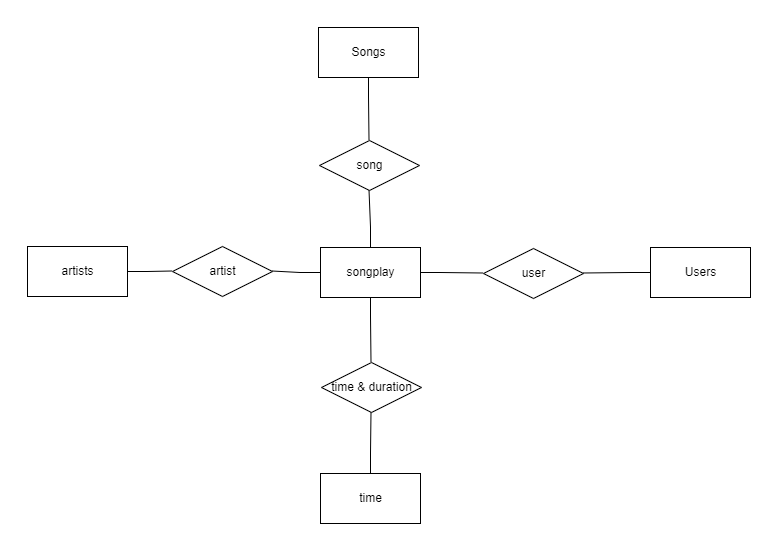

## Introduction:

The Purpose of this Project is to create a Postgres database with tables designed to optimize queries on song play analysis, for a startup called Sparkify who wants to analyze the data they've been collecting on songs and user activity on their new music streaming app.

## Database Schema design and ETL process:

    Database Design

The Database Schema is a $Star Schema$ which consists of a songplay table which is the fact table and the artist table, user table , song table, time table are all dimension tables. The ETL process conssts of transferring data from json files in two local directories into these tables in Postgres.

## Files in Repository:
-> data files
-> create tables.py (create tables and connects to the sparkify db)
-> sql_queries.py (queries for drop, create and insert into tables)
-> etl.py (pipeline in transferring data into the tables)
-> etl.ipynb (Test notebook of the procedure implemented in etl.py)
-> test.ipynb (test notebook to query the tables to check if the data is inserted)

## Execution:
Step1: Open terminal(Linux) or command prompt (Windows) and go to the project directory
Step2: Run the sql_queries python script 
Step3: Run the create tables python script to create the tables and connect to the sparkify database
Step4: Run the etl python script to build the pipeline by extracting, transforming and Loading data from the data files into the tables.
Step 5: Visualize the populated tables by running the test.ipynb file.
